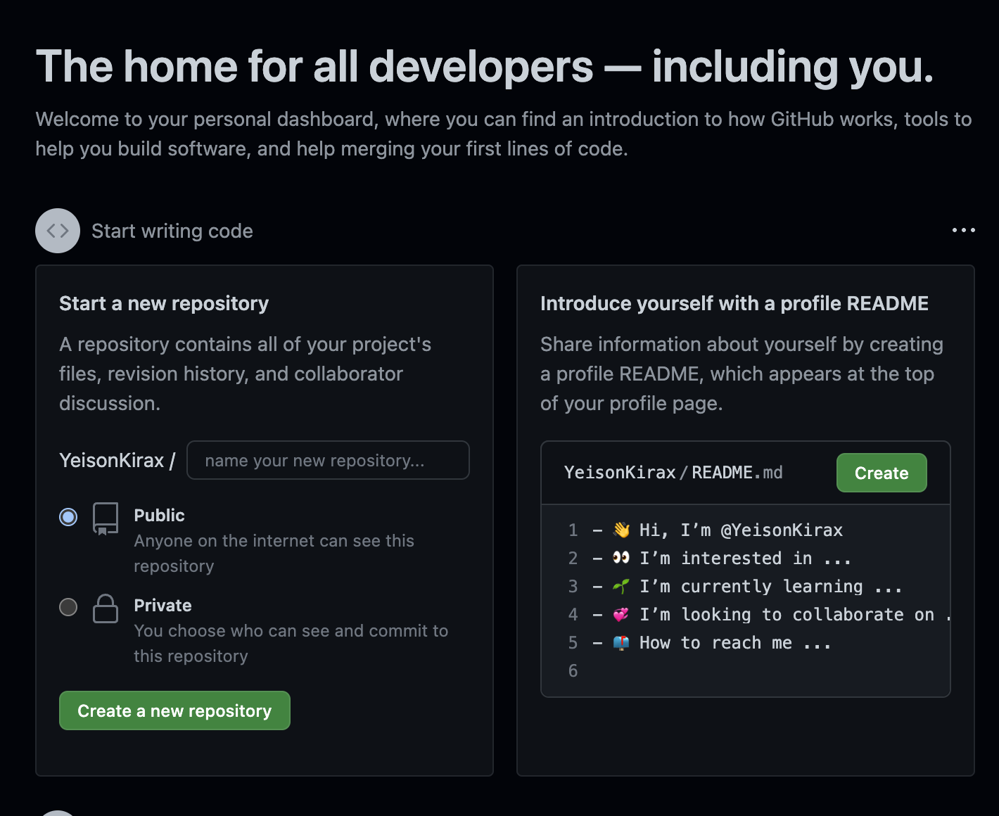
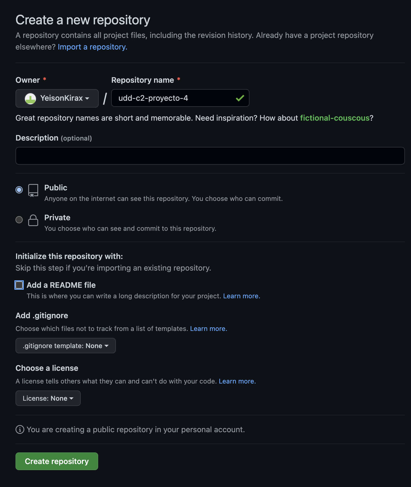
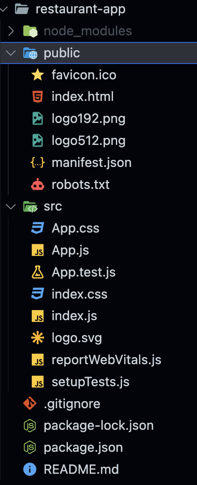

# Creación estructura de proyecto 4: Restaurant

1. Vamos a <a href="https://github.com">GITHUB</a> e iniciamos sesión con nuestra cuenta de github. Una vez iniciados sesión, deberían ver una pantalla como la siguiente:

<p align=center>

</p>

2. Seleccionamos el boton para crear un nuevo repositorio, completando la información y aprietan el boton de crear repositorio.

<p align=center>

</p>

3. Una vez creado nuestro repositorio, clonaremos repositorio git en nuestro pc. Para llevar a cabo esto, se utilizará vs code.

4. A continuación, se configurará las credenciales de git usando: `git config user.name "Nombre"` y `git config user.email "correo@gmail.com"`

5. Ahora crearemos nuestro proyecto base. Para comenzar un proyecto desde cero, nos situaremos en nuestro directorio de trabajo (repo clonado) y utilizaremos el siguiente comando: `npx create-react-app .`. Una vez ejecutado el comando, deberemos de ver una estructura similar a la siguiente:

<p align=center>

</p>

6. A continuación eliminaremos archivos que para efectos prácticos no nos serviran y ajustaremos `app.js`
7. Realizaremos nuestro primer commit usando vscode.
8. Luego, configuraremos el router de nuestra app. Primero instalaremos la librería react-router-dom usando: `npm i -s react-route-dom`. En paralelo, crearemos una carpeta donde guardaremos los componentes a usar llamada components y dentro en primera instancia crearemos un componente para la navbar, sección sobre nosotros, menu y reservas.
9. Para la navbar, el archivo js debe de tener la siguiente estructura:

```Javascript
import React from 'react';
import './navbar.css';
export default function Navbar() {
  return (
    <nav className="navigation">
      <a href="/" className="brand-name">
        Restaurant
      </a>
      <button className="hamburger">
        {/*icon from heroicons.com*/ }
        <svg
          xmlns="http://www.w3.org/2000/svg"
          className="h-5 w-5"
          viewBox="0 0 20 20"
          fill="white"
        >
          <path
            fillRule="evenodd"
            d="M3 5a1 1 0 011-1h12a1 1 0 110 2H4a1 1 0 01-1-1zM3 10a1 1 0 011-1h12a1 1 0 110 2H4a1 1 0 01-1-1zM9 15a1 1 0 011-1h6a1 1 0 110 2h-6a1 1 0 01-1-1z"
            clipRule="evenodd"
          />
        </svg>
      </button>
      <div
        className="navigation-menu">
        <ul>
          <li>
            <a href="/about-us">Nosotros</a>
          </li>
          <li>
            <a href="/menu">Menú</a>
          </li>
          <li>
            <a href="/reservations">Reservas</a>
          </li>
        </ul>
      </div>
    </nav>
  );
}

```

10. El archivo de estilos debe estar en la misma carpeta que `Navbar.js` y debe tener la siguiente estructura.

```Css
.navigation {
  height: 60px;
  width: 100%;
  display: flex;
  align-items: center;
  position: relative;
  padding: 0.5rem 0rem;
  background-color: #fff;
  color: black;
  box-shadow: 0 2px 2px 2px rgba(9, 9, 9, 0.23);
}

.brand-name {
  text-decoration: none;
  color: black;
  font-size: 1.3rem;
  margin-left: 1rem;
}

.navigation-menu {
  margin-left: auto;
}

.navigation-menu ul {
  display: flex;
  padding: 0;
}

.navigation-menu li {
  list-style-type: none;
  margin: 0 1rem;
}

.navigation-menu li a {
  text-decoration: none;
  display: block;
  width: 100%;
}

.hamburger {
  border: 0;
  height: 40px;
  width: 40px;
  padding: 0.5rem;
  border-radius: 50%;
  background-color: #283b8b;
  cursor: pointer;
  transition: background-color 0.2s ease-in-out;
  position: absolute;
  top: 50%;
  right: 25px;
  transform: translateY(-50%);
  display: none;
}

.hamburger:hover {
  background-color: #2642af;
}

@media screen and (max-width: 768px) {
  .hamburger {
    display: block;
  }
}

@media screen and (max-width: 768px) {
  .navigation-menu ul {
    position: absolute;
    top: 60px;
    left: 0;
    flex-direction: column;
    width: 100%;
    height: calc(100vh - 77px);
    background-color: white;
    border-top: 1px solid black;
    display: none;
  }

  .navigation-menu li {
    text-align: center;
    margin: 0;
  }

  .navigation-menu li a {
    color: black;
    width: 100%;
    padding: 1.5rem 0;
  }

  .navigation-menu li:hover {
    background-color: #eee;
  }
}

@media screen and (max-width: 768px) {
  .navigation-menu.expanded ul {
    display: block;
  }
}
```

11. Una vez ajustados los estilos, actualizamos `Navbar.js` para tener la siguiente estructura.

```Javascript
import React, { useState } from 'react';
import './navbar.css';
export default function Navbar() {
  const [ isNavExpanded, setIsNavExpanded ] = useState( false )

  return (
    <nav className="navigation">
      <a href="/" className="brand-name">
        Restaurant
      </a>
      <button className="hamburger" onClick={ () => {
        setIsNavExpanded( !isNavExpanded );
      } }>
        {/* icon from heroicons.com */ }
        <svg
          xmlns="http://www.w3.org/2000/svg"
          className="h-5 w-5"
          viewBox="0 0 20 20"
          fill="white"
        >
          <path
            fillRule="evenodd"
            d="M3 5a1 1 0 011-1h12a1 1 0 110 2H4a1 1 0 01-1-1zM3 10a1 1 0 011-1h12a1 1 0 110 2H4a1 1 0 01-1-1zM9 15a1 1 0 011-1h6a1 1 0 110 2h-6a1 1 0 01-1-1z"
            clipRule="evenodd"
          />
        </svg>
      </button>
      <div
        className={
          isNavExpanded ? "navigation-menu expanded" : "navigation-menu"
        }>
        <ul>
          <li>
            <a href="/about-us">Nosotros</a>
          </li>
          <li>
            <a href="/menu">Menú</a>
          </li>
          <li>
            <a href="/reservations">Reservas</a>
          </li>
        </ul>
      </div>
    </nav>
  );
}
```

12. Con nuestra navbar creada, la agregaremos en nuestro `App.js`, obteniendo la siguiente estructura.

```Javascript
import './App.css';
import Navbar from './components/Navbar/Navbar';

function App() {
  return (
    <div className="App">
      <Navbar />
    </div>
  );
}

export default App;
```

13. Ahora se debe repetir lo mismo para los otros componentes. Una vez generados los componentes restantes, integraremos la librería instalada previamente para el manejo de las rutas asignadas en la barra de navegacion. Para hacer esto modificaremos nuestro `App.js` de la siguiente forma.

```Javascript
import {
  BrowserRouter as Router, Route, Routes
} from "react-router-dom";

import './App.css';

import Menu from './components/Menu/Menu';
import Navbar from './components/Navbar/Navbar';
import Nosotros from './components/Nosotros/Nosotros';
import Reservacion from './components/Reservacion/Reservacion';

function App() {
  return (
    <div className="App">
      <Navbar />
      <Router>
        <Routes>
          <Route
            path="/about-us"
            element={ <Nosotros /> }
          />
          <Route
            path="/menu"
            element={ <Menu /> }
          />
          <Route
            path="/reservations"
            element={ < Reservacion /> }
          />
          <Route
            path="/"
            element={ <Nosotros /> }
          />

        </Routes>
      </Router>
    </div>
  );
}

export default App;
```

14. Una vez realizado lo anterior, realizaremos nuestro formulario de contacto. Para el manejo de formularios, utilizaremos una librería bastante conocida y muy usada llamada Formik. Para instalarla se usará el siguiente comando: `npm i -s formik`.
15. Una vez instalada, construiremos nuestro componente que generará el formilario. Dentro de "Nosotros", crearemos una nueva carpeta llamada Contacto y dentro generaremos el componente `Contacto.js` Y `contact.css` y dentro volveremos a repetir el paso para generar una carpeta llamada "FormularioContacto" y dentro generaremos `FormularioContacto.js` y `formulario-contacto.css`.
16. Dentro de `FormularioContacto.js` agregaremos el siguiente código:

```Javascript
import { useFormik } from 'formik';
import "./formulario-contacto.css"

export default function FormularioContacto() {
  const { handleSubmit, handleChange, values } = useFormik( {
    initialValues: {
      name: "",
      surname: "",
      email: "",
      contactReason: ""
    },
    onSubmit: async function ( values ) {
      console.log( values )
    }
  } )

  return (
    <form onSubmit={ handleSubmit }>
      <label htmlFor='name'>Nombre</label>
      <input id='name' name='name' type="text" value={ values.name } onChange={ handleChange }></input>

      <label htmlFor='surname'>Apellido</label>
      <input id='surname' name='surname' type="text" value={ values.surname } onChange={ handleChange }></input>

      <label htmlFor='email'>Correo</label>
      <input id='email' name='email' type="email" value={ values.email } onChange={ handleChange }></input>

      <label htmlFor='contactReason'>Motivo</label>
      <textarea id='contactReason' name='contactReason' value={ values.contactReason } onChange={ handleChange }></textarea>

      <button type='submit'>Enviar</button>
    </form>
  )
}
```

17. Y dentro de `Contacto.js` lo siguiente:

```Javascript
import FormularioContactoFormik from './FormularioContacto/FormularioContactoFormik';

import "./contacto.css";

export default function Contacto() {

  return (
    <div>
      <FormularioContactoFormik />
    </div>
  )

}
```

18. Luego, en `formulario-contacto.css` incluimos el siguiente estilo:

```Css
* {
  box-sizing: border-box;
}

form {
  width: 300px;
  padding: 16px;
  border-radius: 10px;
  margin: auto;
  background-color: #ccc;
}

form label {
  width: 72px;
  font-weight: bold;
  display: inline-block;
}

form input[type="text"],
form input[type="email"] {
  width: 180px;
  padding: 3px 10px;
  border: 1px solid #f6f6f6;
  border-radius: 3px;
  background-color: #f6f6f6;
  margin: 8px 0;
  display: inline-block;
}

form input[type="submit"] {
  width: 100%;
  padding: 8px 16px;
  margin-top: 32px;
  border: 1px solid #000;
  border-radius: 5px;
  display: block;
  color: #fff;
  background-color: #000;
}

form input[type="submit"]:hover {
  cursor: pointer;
}

textarea {
  width: 100%;
  height: 100px;
  border: 1px solid #f6f6f6;
  border-radius: 3px;
  background-color: #f6f6f6;
  margin: 8px 0;
  resize: none;
  display: block;
}
```

19. Ahora trataremos de persistir la información de contacto en firebase. Para realizar esto, deberemos de integrar firebase a nuestro proyecto. En primer lugar, debemos ir a <a href="https://firebase.google.com">Firebase</a> e iniciamos sesión con google. Luego en proyectos añadiremos un proyecto.

20. Una vez creado el proyecto, registraremos nuestra app de restaurante y deberemos de guardar el script de configuración
21. Luego instalaremos firebase en nuestro proyecto usando `npm i -s firebase`
22. Luego en la página nos vamos a "Cloud Firestore" y crearemos una base de datos. En este caso la colleción a agregar será "Contactos".
23. Una vez creada la colección, dentro del proyecto crearemos un nuevo archivo llamado `firestore.js`, este se guardará en una carpeta llamada "config" y tendrá la siguiente estructura.

```Javascript
import { initializeApp } from "firebase/app";
import { getFirestore } from "firebase/firestore"

// Your web app's Firebase configuration
const firebaseConfig = {
  apiKey: "X",
  authDomain: "X",
  projectId: "X",
  storageBucket: "X",
  messagingSenderId: "X",
  appId: "X"
};

const firebaseApp = initializeApp( firebaseConfig );
export const db = getFirestore( firebaseApp );
// Initialize Firebase
```

24. Una vez creado el archivo de config de firebase, nos iremos al componente del formulario para modificarlo y agregar la lógica para persistir los datos de contacto en firestore. Debe quedar de la siguiente forma.

```Javascript
import { addDoc, collection } from "firebase/firestore";
import { useFormik } from 'formik';
import { db } from '../../../../config/firestore';
import "./formulario-contacto.css";

export default function FormularioContacto() {
  const { handleSubmit, handleChange, values } = useFormik( {
    initialValues: {
      name: "",
      surname: "",
      email: "",
      contactReason: ""
    },
    onSubmit: async function ( values ) {
      console.log( values )
      try {
        const docRef = await addDoc( collection( db, "Contactos" ), values );
        console.log( "Document written with ID: ", docRef.id );
      } catch ( e ) {
        console.error( "Error adding document: ", e );
      }
    }
  } )

  return (
    <form onSubmit={ handleSubmit }>
      <label htmlFor='name'>Nombre</label>
      <input id='name' name='name' type="text" value={ values.name } onChange={ handleChange }></input>

      <label htmlFor='surname'>Apellido</label>
      <input id='surname' name='surname' type="text" value={ values.surname } onChange={ handleChange }></input>

      <label htmlFor='email'>Correo</label>
      <input id='email' name='email' type="email" value={ values.email } onChange={ handleChange }></input>

      <label htmlFor='contactReason'>Motivo</label>
      <textarea id='contactReason' name='contactReason' value={ values.contactReason } onChange={ handleChange }></textarea>

      <button type='submit'>Enviar</button>
    </form>
  )
}
```

25. A continuar programando.
